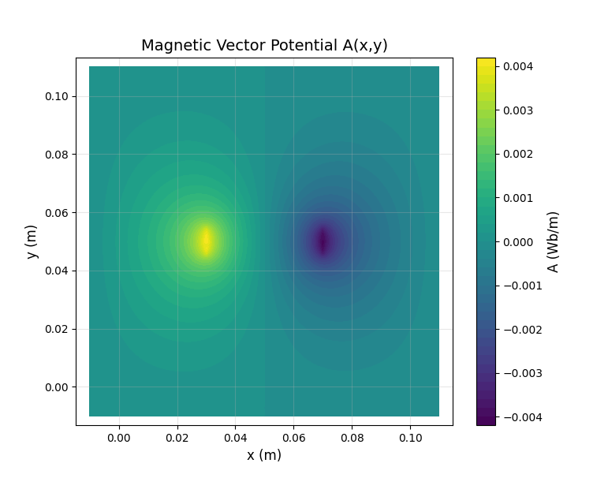

<!--
Color Palette:
#FFFFFF - pure white 
#F3A51C - rich, warm golden-orange 

It's a simple piece of kit, but being able to integrate
FEMM solutions directly into the pipeline is extremely
useful.

- William Bowley, 2026-08-17

P.S: Thanks for downloading the FEMMInterpreter repository `▽`ʃ♡
-->

> [!WARNING]
> This library is still under development and hasn't been fully documented nor fully test covered. The abstraction boundaries may change with future releases. 

## Overview


A Python library for interpreting Finite Element Method Magnetic (FEMM) files and exposing the extracted solution in an attribute tree structure. `FEMMInterpreter` also constructs the `B-field` from the `A-field` and exposes both as `A(x,y)` and `B(x,y)`, independent of planar or axisymmetric coordinate systems.

> [!IMPORTANT]
> This tool will focus on the magnetic domain for now, but can be expanded in the future to cover all FEMM solutions.

---

<!-- Need to update that image before updating to PyPi -->

<div align="center">
  
    <p><em>Figure 1: Magnetic vector potential extracted from FEMM (.ans)</em></p>
</div>

## Quick Start

```py
from FEMMInterpreter import Parser

# Imports the parser and parses the .ans file
PATH = "development/magnetostatic.ans"
data = Parser.open(PATH)
```

## Installation

To install:

```bash
# Recommended for most users
pip install FEMMInterpreter
```

## Documentation

> [!note]
> Documentation for attribute classes can be found [here](docs/attributes.pdf)

All internal documentation can be found within this repo's [issues](https://github.com/wgbowley/FEMMInterpreter/issues).

### Tags
```
LX -> Documentation and project structure
L0 -> Requirements and Objectives
L1 -> Architecture and implementation
L2 -> Validation of the codebase
DS -> Descoped Feature, Descoped Analysis 
```
