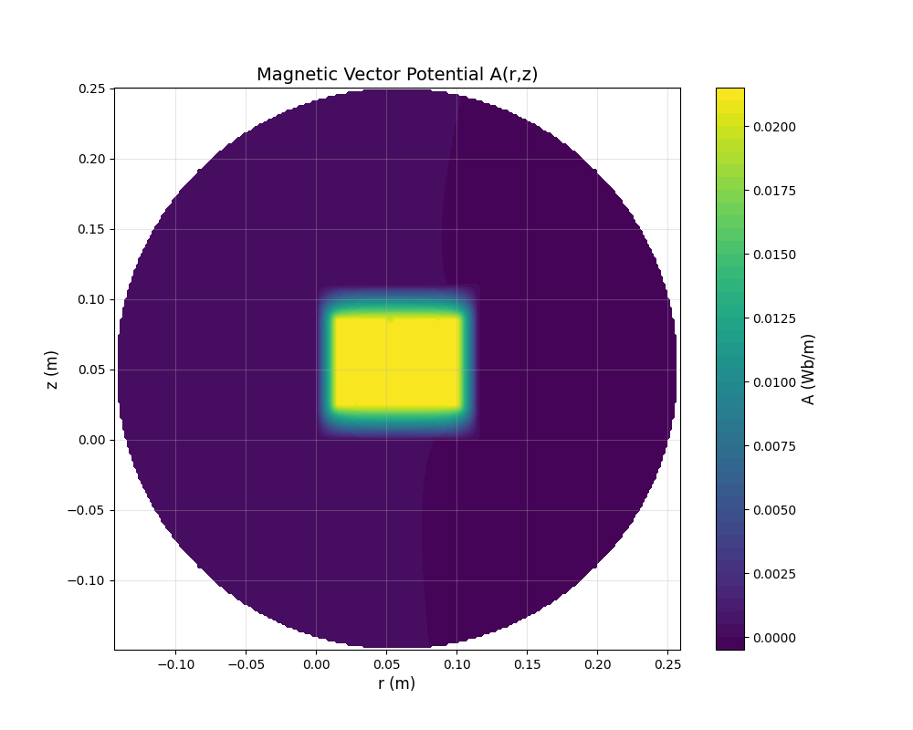

## Overview
A python library for interpreting FEMM solution files

> [!important]
> This tool will focus on the magnetic domain for now. And can be expanded in the future across all of FEMM solutions.

<div align="center">
  
    <p><em>Figure 1: Magnetic vector potential extracted from FEMM (.ans)</em></p>
</div>

## Documentation

All internal documentation can be found within this repo's [issues](https://github.com/wgbowley/FEMMInterpreter/issues).


### Tags
```
LX -> Documentation and project structure
L0 -> Requirements and Objectives
L1 -> Architecture and implementation
L2 -> Validation of the codebase
DS -> Descoped Feature, Descoped Analysis 
```
